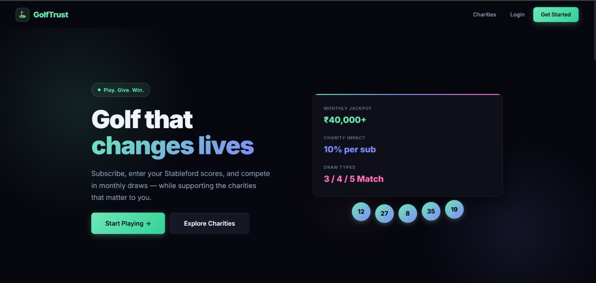
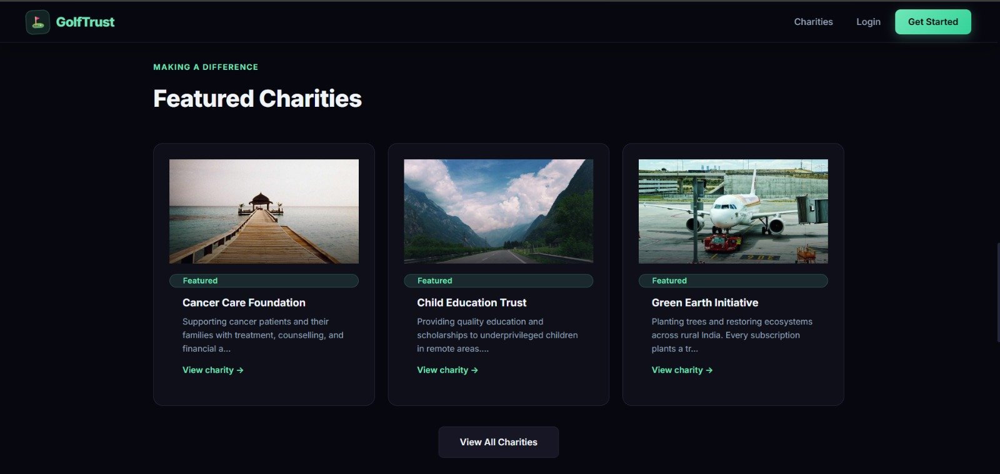
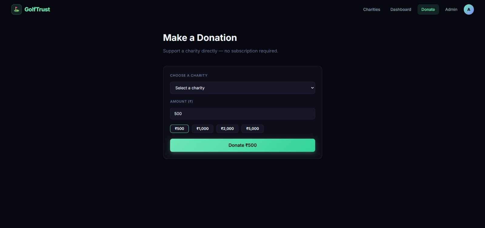
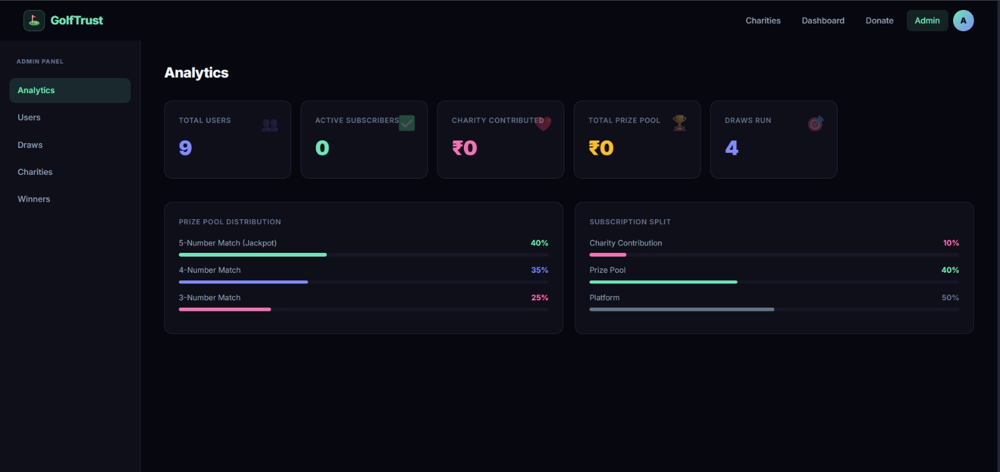

GolfTrust — Golf Charity Subscription Platform
Submitted for Digital Heroes · digitalheroes.co.in
Trainee Selection Assignment · March 2026

────────────────────────────────────────────────────────────

SCREENSHOTS
------------------------------------------------------------------------

SCREENSHOTS

  Home Page
  

  Featured Charities
  

  Donate Page
  

  Admin Dashboard
  

LIVE PLATFORM

  Website       https://goltruist-assignment.vercel.app
  Backend API   https://goltruist.vercel.app/api/health
  Repository    https://github.com/Sumant3086/Goltruist

────────────────────────────────────────────────────────────

OVERVIEW

GolfTrust is a subscription-driven web platform that combines golf performance
tracking, monthly prize draws, and charitable giving. It is designed to feel
emotionally engaging and modern — deliberately avoiding the aesthetics of a
traditional golf website.

Users subscribe to the platform, enter their Stableford golf scores, participate
in monthly draw-based prize pools, and support a charity of their choice with a
portion of every subscription.

────────────────────────────────────────────────────────────

TEST CREDENTIALS

  Subscriber
    Email     testplayer@golftrust.com
    Password  test1234

  Administrator
    Email     admin@golftrust.com
    Password  admin1234

  To create your own admin account, register normally then contact the
  repository owner to elevate the role.

────────────────────────────────────────────────────────────

TECH STACK

  Frontend    React 18 + Vite + Framer Motion
  Backend     Node.js + Express
  Database    Supabase (PostgreSQL)
  Auth        JWT (jsonwebtoken + bcryptjs)
  Payments    Razorpay
  Storage     Supabase Storage (winner proof uploads)
  Deployment  Vercel (frontend + backend as serverless)

────────────────────────────────────────────────────────────

FEATURES IMPLEMENTED

  Subscription Engine
    Monthly plan (₹999) and Yearly plan (₹8,999)
    Razorpay payment integration with signature verification
    Subscription lifecycle — active, cancelled, lapsed states
    Real-time subscription status check on every request

  Score Management
    Rolling 5-score system in Stableford format
    Score range validation: 1 to 45
    Each score includes a date
    Newest scores displayed first, oldest auto-replaced

  Draw and Reward System
    Three match types: 5-number, 4-number, 3-number
    Two draw modes: random lottery and weighted algorithm
    Simulation mode before official publish
    Jackpot rollover when no 5-match winner is found
    Prize pool split: 40% jackpot, 35% four-match, 25% three-match

  Charity System
    Charity selection at signup
    Minimum 10% contribution per subscription
    User-adjustable contribution percentage
    Independent donation option (not tied to gameplay)
    Charity directory with search, filter, and featured spotlight

  Winner Verification
    Proof upload (screenshot of scores)
    Admin approve or reject workflow
    Payment states: pending to paid

  User Dashboard
    Subscription status with renewal date
    Score entry and edit interface
    Selected charity and contribution percentage
    Draw participation summary
    Winnings overview with payment status

  Admin Dashboard
    User management — view, edit, role control
    Score editing per user
    Subscription management — cancel or reactivate
    Draw management — simulate, run, publish
    Charity management — add, edit, deactivate
    Winner verification and payout tracking
    Analytics — total users, prize pool, charity totals, draw stats

────────────────────────────────────────────────────────────

PROJECT STRUCTURE

  client/               React + Vite frontend
    src/
      pages/            All route-level pages
      components/       Reusable UI components
      context/          Auth context with JWT persistence
      lib/              Axios API client

  server/               Node.js + Express backend
    src/
      routes/           All API route handlers
      middleware/        JWT auth + admin guard
      config/           DB, Supabase, Razorpay config
      utils/            Draw engine logic
    supabase/           PostgreSQL schema
    scripts/            Migration, seed, and test scripts

────────────────────────────────────────────────────────────

DATABASE SCHEMA

  charities             Charity listings with featured flag
  users                 Subscribers and admins with charity link
  subscriptions         Plan, status, Razorpay IDs, expiry
  scores                Rolling 5 Stableford scores per user
  draws                 Draw results with numbers and prize tiers
  draw_entries          Per-user draw participation records
  winners               Match results with verification and payout
  contributions         Charity and prize pool amounts per payment
  donations             Independent charity donations
  jackpot               Persistent jackpot carryover amount

────────────────────────────────────────────────────────────

API ENDPOINTS

  Auth
    POST  /api/auth/register
    POST  /api/auth/login

  Users
    GET   /api/users/me
    PATCH /api/users/me

  Scores
    GET   /api/scores
    POST  /api/scores
    PATCH /api/scores/:id

  Subscriptions
    POST  /api/subscriptions/create-order
    POST  /api/subscriptions/verify
    GET   /api/subscriptions/status
    POST  /api/subscriptions/cancel

  Draws
    GET   /api/draws
    GET   /api/draws/latest
    GET   /api/draws/:id/my-result

  Charities
    GET   /api/charities
    GET   /api/charities/:id

  Winners
    GET   /api/winners/me
    POST  /api/winners/:id/upload-proof

  Donations
    POST  /api/donations/create-order
    POST  /api/donations/verify

  Admin (requires admin role)
    GET   /api/admin/users
    PATCH /api/admin/users/:id
    GET   /api/admin/users/:id/scores
    PATCH /api/admin/subscriptions/:userId
    POST  /api/admin/charities
    PATCH /api/admin/charities/:id
    DELETE /api/admin/charities/:id
    POST  /api/admin/draws/simulate
    POST  /api/admin/draws/run
    PATCH /api/admin/draws/:id/publish
    GET   /api/admin/winners
    PATCH /api/admin/winners/:id/verify
    PATCH /api/admin/winners/:id/payout
    GET   /api/admin/analytics

────────────────────────────────────────────────────────────

RUNNING LOCALLY

  Prerequisites: Node.js 18+, a Supabase project, Razorpay test keys

  1. Clone the repository
     git clone https://github.com/Sumant3086/Goltruist.git

  2. Set up the backend
     cd server
     npm install
     Copy .env.example to .env and fill in your values
     node scripts/migrate2.js
     node scripts/migrate3.js
     node scripts/seed.js
     npm run dev

  3. Set up the frontend
     cd client
     npm install
     npm run dev

  4. Open http://localhost:5173

────────────────────────────────────────────────────────────

ENVIRONMENT VARIABLES

  Backend (server/.env)
    PORT                  Express server port
    JWT_SECRET            Secret for signing JWT tokens
    DATABASE_URL          PostgreSQL connection string
    SUPABASE_URL          Supabase project URL
    SUPABASE_SERVICE_KEY  Supabase service role key
    RAZORPAY_KEY_ID       Razorpay API key ID
    RAZORPAY_KEY_SECRET   Razorpay API key secret
    CLIENT_URL            Frontend URL for CORS

  Frontend (client/.env)
    VITE_API_URL          Backend API base URL (production only)

────────────────────────────────────────────────────────────

TEST RESULTS

  All 46 automated API tests pass.

  Auth — register, login, bad credentials rejected
  Charities — list, filter, featured, detail
  Scores — subscription gate, range validation (1–45)
  Subscriptions — status, invalid plan rejected, Razorpay orders
  Draws — public listing, latest draw
  Admin — analytics, user management, charity CRUD, draw engine
  Security — non-admin blocked (403), unauthenticated blocked (401)

  Run tests locally:
    cd server && node scripts/full-test.js

────────────────────────────────────────────────────────────

SCALABILITY NOTES

  The architecture is designed to support future expansion:

  Multi-country support — currency and locale can be parameterised
  Team and corporate accounts — user roles are extensible
  Campaign module — draw engine supports custom configurations
  Mobile app ready — REST API is fully decoupled from the frontend
  Connection pooling — Supabase transaction pooler used in production

────────────────────────────────────────────────────────────

Prepared by Sumant Yadav
Assignment submission for Digital Heroes · digitalheroes.co.in
March 2026

